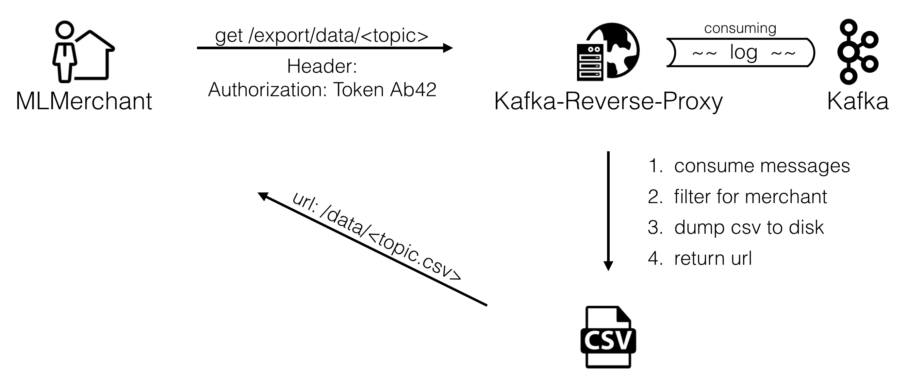

# Kafka Proxy

This repository contains the Kafka Proxy which acts as an interfacing components between our Kafka streams and the components that need access to it. These components are:

* Flink: Flink reads from and writes to Kafka topics to do aggregation and calculate statistics 
* Management UI: The management UI needs to read from the live sales-data from the marketplace to display realtime pricing interaction between merchants. It also needs access to the aggregated statistics from Flink to visualize the performance of the merchants.
* Merchants: Data-driven merchants have to be able to retrieve past market situations written to Kafka to do their learning. However, they should only be allowed to access the market situation data that they would have access to on a real system as well, ie the offers that were on the marketplace at a certain time and only their own sales data.

The meta repository containing general information can be found [here](https://github.com/hpi-epic/masterproject-pricewars)

## Application Overview

| Repo | Branch 	| Deployment to  	| Status | Description |
|--- |---	|---	|---  |---   |
| [UI](https://github.com/hpi-epic/pricewars-mgmt-ui) | master  	|  [vm-mpws2016hp1-02.eaalab.hpi.uni-potsdam.de](http://vm-mpws2016hp1-02.eaalab.hpi.uni-potsdam.de) 	| [ ](https://app.codeship.com/projects/184009) | Stable |
| [Consumer](https://github.com/hpi-epic/pricewars-consumer) | master  	|  [vm-mpws2016hp1-01.eaalab.hpi.uni-potsdam.de](http://vm-mpws2016hp1-01.eaalab.hpi.uni-potsdam.de) | [ ](https://app.codeship.com/projects/180119) | Stable |
| [Producer](https://github.com/hpi-epic/pricewars-producer) | master  	|  [vm-mpws2016hp1-03eaalab.hpi.uni-potsdam.de](http://vm-mpws2016hp1-03.eaalab.hpi.uni-potsdam.de) | [ ](https://app.codeship.com/projects/184016) | Stable |
| [Marketplace](https://github.com/hpi-epic/pricewars-marketplace) | master  	|  [vm-mpws2016hp1-04.eaalab.hpi.uni-potsdam.de/marketplace](http://vm-mpws2016hp1-04.eaalab.hpi.uni-potsdam.de/marketplace/offers) 	| [ ](https://app.codeship.com/projects/184015) | Stable |
| [Merchant](https://github.com/hpi-epic/pricewars-merchant) | master  	|  [vm-mpws2016hp1-06.eaalab.hpi.uni-potsdam.de/](http://vm-mpws2016hp1-06.eaalab.hpi.uni-potsdam.de/) 	| [ ](https://app.codeship.com/projects/184013) | Stable |
| [Kafka RESTful API](https://github.com/hpi-epic/pricewars-kafka-rest) | master  	|  [vm-mpws2016hp1-05.eaalab.hpi.uni-potsdam.de](http://vm-mpws2016hp1-05.eaalab.hpi.uni-potsdam.de) 	|  [ ](https://app.codeship.com/projects/186252) | Stable |

## Requirements

The kafka proxy is written in Python. Ensure to have [Python](https://www.python.org/) and pip installed and set up on your computer.

## Setup

After cloning the repository, install the necessary dependencies with `pip install -r requirements.txt` (Linux, MacOS) resp. `python -m pip install -r requirements.txt` (Windows). 

Then start the kafka proxy by running `python LoggerApp.py`. The LoggerApp will run on _ http://localhost:8001 _.

## Configuration

The kafka proxy only needs the URL of the kafka endpoints. This URL is currently hardcoded in the `LoggerApp.py` in line 24.

## Concept

The Kafka reverse proxy is the connection between the logged Kafka data and all their consumers. These include

1. the Management UI (Socket IO)
2. Merchants (CSV, Content access control)

## Interfaces

### Socket IO

Socket.io is used to forward Kafka log messages to our real-time front end. All topics that are forwarded in realtime (including the topics that contain the aggregations and statistics from Flink) can be found line 37++ of the `LoggerApp.py`. To add, delete or update topics, simply change the `topics`-array. 

Furthermore, we use Socket.io to forward historic data to the front end. This allows the frontend to not start with empty graphs when the user enters a site, but to give the user an idea of the past data. This historic data is sent out to any client whenever it connects to our kafka reverse proxy. Currently, we consider the last 100 messages of each topic as historic data, ie a client that connects will receive for each topic the last 100 messages in a bulk-message via socket.io.

### Filtered data view as CSV

For merchants to view past market situations and use them for training a model, the kafka reverse proxy offers the export of this data as a csv-file: 



#### Request data export

The data export can be triggered using a GET-request on the _/export/data_-route. The export expects a merchant_token in the _Authorization_-header so that the exported data only includes the data visible to the merchant belonging to that token.

```
HTTP GET export/data/
```

generates a CSV file for the given merchant_token and returns the path as json:

```
{"url": "data/dump.csv"}
```

The route can also be extended with a specific topic name to only generate the CSV for that specific topic, eg.:
```
HTTP GET export/data/buyOffers
```

#### Receiving CSV file

To retrieve the CSV file, do a GET-request on the returned path:

```HTTP GET data/dump.csv```
